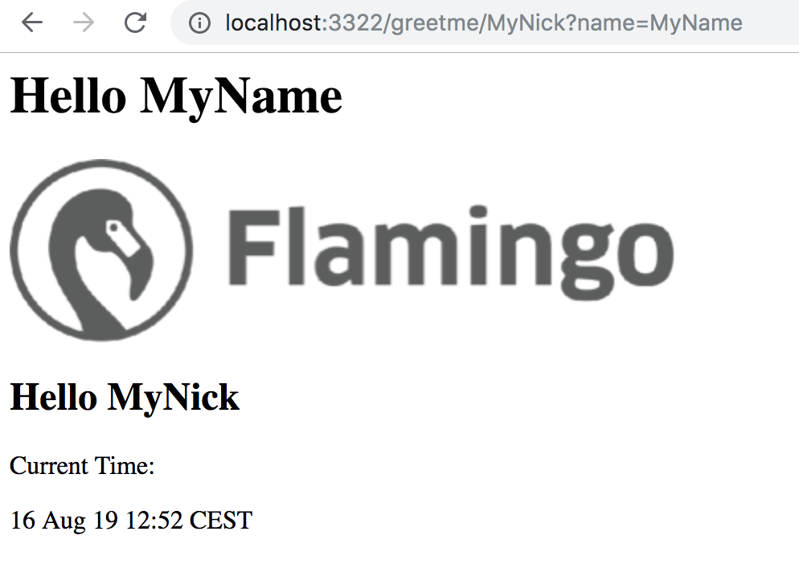

# Tutorial Flamingo Carotene

In this tutorial and example you will learn how to use Flamingo Carotene based frontend templating to your project. 

## Step 1 "Kickstart Flamingo Carotene"

Checkout the example and roll back to step0:

```
git clone git@github.com:i-love-flamingo/example-flamingo-carotene.git
cd example-flamingo-carotene
git checkout step0
```

This a flamingo project with the helloworld package (from the example-helloworld)
You can start it with

```
make serve
```

And open http://localhost:3322/hello

As you see Flamingo has no template engine registered and therefore falls back to return the template variables in a JSON structure.

Now we will add the Flamingo Carotene template engine to the project.
We can simple follow the steps in the official documentation:

Follow the instructions in the ["getting started" documentation](https://docs.flamingo.me/5.%20Template%20Engine%20Flamingo%20Carotene/1.%20Introduction/02-getting-started.html#prepare-the-frontend)
Including the steps to add webpack and assets!

Now if you run:

```
cd frontend && npx flamingo-carotene build
make serve
```
and open http://localhost:3322/  you should see the index.pug content (Hello World)

If you open http://localhost:3322/hello instead you should see an error page rendered by the pug template engine - telling that the template "hello" is not present.


## Step 2 "Helloworld Template"

Goal of this step is to add a template that is used by the "helloworld" controller that is part of the example.

You should have finished the steps in "step0" before you continue.
As an alternative you can checkout the branch "step1":

```
git stash
git checkout step1
```

Now add the template in `frontend/src/page/hello/hello.pug` with the following content:

```
h1 Hello #{name}
img(src=asset("asset/logo.png"))
if nickname == "aoepeople"
    h2 Ah you are from AOE :-)
else
    h2 Hello #{nickname}

p Current Time:
p=data("currenttime")
```

Place the image that we reference in the template inside `frontend/src/asset/logo.png`

Now run:

```
make frontend-build
make serve
```

and open http://localhost:3322/greetme/MyNick?name=MyName

You should see something like:




## Step 3 "Using pug Templates"

Goal of this step is to add a pug template (layout) that is used by the "hello.pug" page template.

Add a file `frontend/src/template/base/base.pug` with the follwing content:

```
html
  head
    meta(charset='utf-8')
    link(rel="stylesheet", href=asset("css/main.css"))
    script(src=asset("js/main.js"))

  body
    header
      img(src=asset("asset/logo_b_w.png"))
      h1 Flamingo Carotene Example
      p Time is #{data("currenttime")}

    .content
      block content
        h1 Content Area
```

Add a file `frontend/src/template/base/base.sass` with the following content:

```
body
  padding: 0
  margin: 0
  font-family: Arial, sans-serif
  

header
  background-color: "#eeeeee"
  color: $white
  min-height: 60px
  padding: 0 0 0 40px
```

Make sure this sass file is included in the build by adding it to the entry file `frontend/src/index.sass` :

```
@import 'template/**/*.sass'
```

Now use this pug template and modify the file `frontend/src/page/hello/hello.pug` like this:

```
extends /template/base/base

block content
    h1 Hello #{name}
    if nickname == "aoepeople"
        h2 Ah you are from AOE :-)
    else
        h2 Hello #{nickname}

    p Current Time:
    p=data("currenttime")
```

Now run again:

```
make frontend-build
make serve
```

You will see a styled page with the common header.


## Step 4 "Adding a component"

Goal of this step is to add a reusable button component that renders a button.

Therefore add a file `frontend/src/component/button/button.pug`:

```
mixin button(linkUrl)
  a.button(href=linkUrl)
    if block
      block
```

And the corresponding CSS in `frontend/src/component/button/button.sass`:

```
.button
  display: inline-block
  box-shadow: darkgray
  border-radius: 2px
  min-height: 20px
  min-width: 20px
  background-color: green
  border: 1px solid darkgreen
  color: white
  text-decoration: none
  padding: 5px
  margin: 5px
```

Then use this mixin in your hello page template:

```
... 
include /component/button/button

...
...

    +button("http://www.flamingo.me")
        | My button 

```


## Step 5 Development support

With the help of the dev server you get hot rebuild and reloading on file changes in the frontend - which can improve your frontend development workflow a lot.

All you have to do is install the flamingo carotene module `flamingo-carotene-dev-server`:

```
cd frontend
npm i -D flamingo-carotene-dev-server
```

And then run:

```
npx flamingo-carotene build && npx flamingo-carotene dev
```

The command `npx flamingo-carotene dev`  will not exit and watch for file changes inside the `src` folder - and rebuild the frontend artefacts if something was changed.
